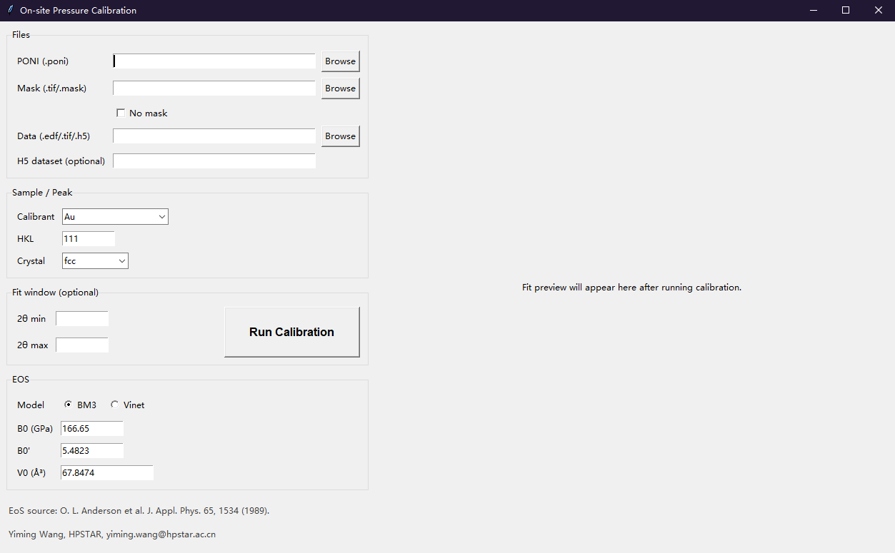

# On-site-Pressure-Calibration

A **simple, fast, and accurate** software tool for pressure calibration in high-pressure X-ray diffraction (XRD) experiments.

This program determines sample pressure using the **equation-of-state (EOS) method**, enabling reliable pressure evaluation directly from diffraction data. It supports multiple commonly used pressure standards, including **Au, Cu, Mo, Pt, Re, MgO**, and allows full customization of reference materials.

This is an **open-source software written in Python**. It can be executed directly from the command line on any operating system with Python installed, or by downloading a precompiled **Windows `.exe` executable** for immediate use.

## Software Interface

---

### Features

- ✅ EOS-based pressure calibration for high-pressure XRD experiments  
- ✅ Built-in support for common pressure standards: **Au, Cu, Mo, Pt, Re, MgO**, etc.  
- ✅ Custom calibrant definition:
  - Crystal symmetry
  - Diffraction plane (HKL)
  - EOS model selection:
    - 3rd-order Birch–Murnaghan (BM3)
    - Vinet EOS
  - User-defined EOS parameters
- ✅ Direct reading of raw experimental data
- ✅ No additional preprocessing required after calibration in **DIOPTAS**
- ✅ Automatic generation of calibration figures for every pressure evaluation, enabling **data archiving, traceability, and post-experiment verification**

---

### Requirements (Python Version)

The command-line version requires the following Python packages:

- `numpy`
- `fabio`
- `h5py`
- `pyFAI`

---

### Workflow

1. Calibrate the standard material in **DIOPTAS**.
2. Export the `.poni` file (optional `.mask` file supported).
3. Load experimental datasets directly into this program.
4. Perform rapid pressure calibration.
5. Calibration figures are automatically saved for documentation and later validation.

---

### Supported Data Formats

- `.edf`
- `.tif`
- `.h5/.hdf5`

---

### Experimental Validation

The software has been tested during on-site experiments at the **4th-generation Brazilian Synchrotron Light Source (CNPEM)** and received positive feedback from beamline engineers for its efficiency and usability.

---

### Try It Now

Start using the tool immediately to streamline pressure calibration in high-pressure XRD experiments.
